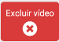
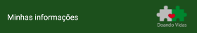
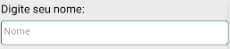
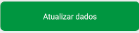
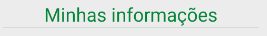
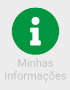

# Documentação dos componentes

Todos os componentes usado até agora no projeto

## EditButton

É o botão utilizado na aba de vídeo

### Parâmetros

<b>icon</b>: Recebe um ícone em forma de string

<b>text</b>: O texto dentro do botão

<b>colorButton</b>: Cor do botão

<b>onClick</b>: Evento de click do botão

## Header

Componente utilizado em quase todas as telas

### Parâmetros

<b>text</b>: Texto ao lado esquerdo do header

<b>sizeText</b>:tamanho do text

## Input

Componente utilizado em quase todos os inputs da aplicação

### Parâmetros

<b>placeholder</b>: Texto de dentro do input

<b>borderColor</b>: cor da borda

<b>onKeyPress</b>: Evento de click do botão

<b>label</b>: Texto acima do botão

<b>style</b>: aponta direto para o style do botão, caso necessite fazer qualquer outra alteração no estilo do componente

<b>onKeyPress</b>: Evento de click do botão

<b>password</b>: Booleano indicando se o Input será de senha ou não

## MainButton

Componente utilizado em eventos principais, como cadastro, login, atualização de dados, etc.

### Parâmetros

<b>text</b>: Texto do botão

<b>bgColor</b>: Cor do botão

<b>textColor</b>: Cor do texto do botão

## Title

Componente utilizado para indicar o título do tópico. Utilizado na maioria das telas.

### Parâmetros

<b>title</b>: Texto do componente

## Topic

Componente utilizado para indicar o link para algum tópico, ou nova página navegável da aplicação

### Parâmetros

<b>icon</b>: Ícone do  tópico -- Deverá ser do FontAwesomeIcon

<b>text</b>: Texto do tópico que vai abaixo do Ícone. no máximo duas palavras. 

<b>onPress</b>: Evento de click do tópico

<b>backgroundText</b>: cor do texto abaixo do ícone

<b>size</b>: Tamanho do ícone

<b>style</b>: Aponta diretamente para o estilo do componente

